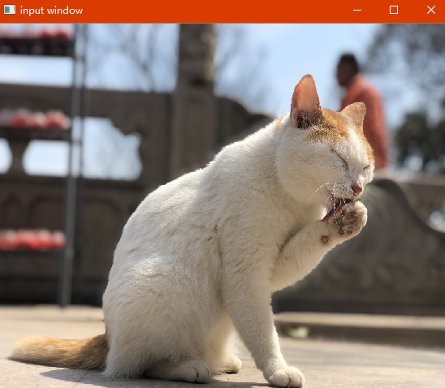
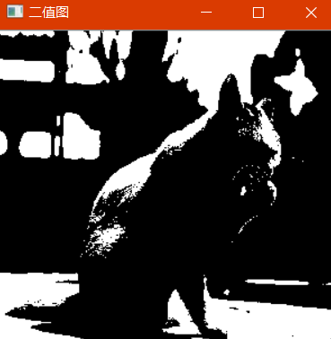
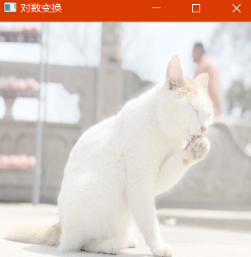
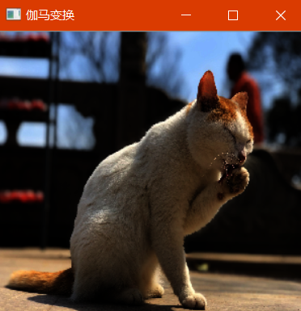
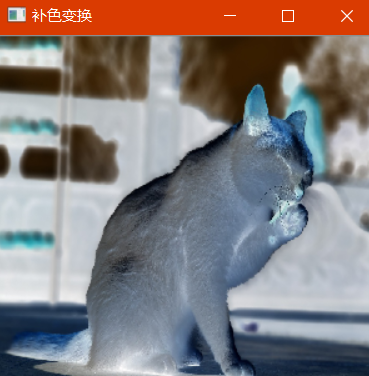

# OpenCV_Lab1_图像变换

## 一、实验目的

1. 掌握OpenCV进行图像处理的基础，实现图像的灰度变换处理
2. 掌握OpenCV的安装
3. 掌握OpenCV对图像进行基本操作
4. 掌握利用OpenCV对图像进行灰度变换

## 二、 实验内容

### 1，利用 OpenCV 读取图像。

​    *> 具体内容：用打开 OpenCV 打开图像，并在窗口中显示*

### 2，灰度图像二值化处理

​    *> 具体内容：设置并调整阈值对图像进行二值化处理。*

### 3，灰度图像的对数变换

​    *> 具体内容：设置并调整 r 值对图像进行对数变换。*

### 4，灰度图像的伽马变换

​    *> 具体内容：设置并调整γ值对图像进行伽马变换。*

### 5，彩色图像的补色变换

​    *> 具体内容：对彩色图像进行补色变换。*

## 三、实验原理
### 1，利用 OpenCV 读取图像。
首先使用imread()读取目标图像为灰度图。 
实验代码
```c++
Mat src, dst;
 	//将图像以彩色图像导入
	src = imread("D:/workspace/images/smallCat.jpg", 1);
	if (!src.data) {
		printf("could not load image...\n");
		return -1;
	}
	namedWindow("input window", 0);
	imshow("input window", src);
```
### 2，灰度图像二值化处理
对每个像素遍历，判断其灰度值，当灰度值大于某一参数时，置灰度值为255，小于时置0。  
其中二值化处理对阈值的选取有以下几种方法：
- 双峰法
- P参数法
- 大津法
- 最大熵阈值法
- 迭代法
本实验采用迭代法选取阈值
```c++
//迭代法
int DetectThreshold(IplImage* src) {
	uchar iThrehold;//阈值
	try {
		int height = src->height;
		int width = src->width;
		//相邻行的同列点之间的字节数
		int step = src->widthStep / sizeof(uchar);
		uchar *data = (uchar*)src->imageData;

		int iDiffRec = 0;
		int F[256] = { 0 }; //直方图数组  
		int iTotalGray = 0;//灰度值和  
		int iTotalPixel = 0;//像素数和  
		uchar bt;//某点的像素值  

		uchar iNewThrehold;//新阀值
		//原图像中的最大灰度值和最小灰度值  
		uchar iMaxGrayValue = 0, iMinGrayValue = 255;
		uchar iMeanGrayValue1, iMeanGrayValue2;
		//获取(i,j)的值，存于直方图数组F  
		for (int i = 0; i < width; i++)
		{
			for (int j = 0; j < height; j++)
			{
				bt = data[i*step + j];
				if (bt < iMinGrayValue)
					iMinGrayValue = bt;
				if (bt > iMaxGrayValue)
					iMaxGrayValue = bt;
				F[bt]++;
			}
		}
		iThrehold = 0;
		iNewThrehold = (iMinGrayValue + iMaxGrayValue) / 2;//初始阀值  
		iDiffRec = iMaxGrayValue - iMinGrayValue;
		//迭代中止条件  
		for (int a = 0; (abs(iThrehold - iNewThrehold) > 0.5); a++)
		{
			iThrehold = iNewThrehold;
			//小于当前阀值部分的平均灰度值  
			for (int i = iMinGrayValue; i < iThrehold; i++)
			{
				iTotalGray += F[i] * i;//F[]存储图像信息  
				iTotalPixel += F[i];
			}
			iMeanGrayValue1 = (uchar)(iTotalGray / iTotalPixel);
			//大于当前阀值部分的平均灰度值  
			iTotalPixel = 0;
			iTotalGray = 0;
			for (int j = iThrehold + 1; j < iMaxGrayValue; j++)
			{
				iTotalGray += F[j] * j;//F[]存储图像信息  
				iTotalPixel += F[j];
			}
			iMeanGrayValue2 = (uchar)(iTotalGray / iTotalPixel);
			//新阀值  
			iNewThrehold = (iMeanGrayValue2 + iMeanGrayValue1) / 2; 
			iDiffRec = abs(iMeanGrayValue2 - iMeanGrayValue1);
		}
	}
	catch (cv::Exception e)
	{
	}

	return iThrehold;
}
```
### 3，灰度图像的对数变换
对数变换主要用于将图像的低灰度值部分扩展，将其高灰度值部分压缩，以达到强调图像低灰度部分的目的。  

公式为：
$$
f(x,y) = log(1+i)
$$
代码如下：

```c++
Mat toLog(Mat src) {
	double pixels[256];
	for (int i = 0; i < 256; i++)
		pixels[i] = log(1 + i);

	Mat result(src.size(), CV_32FC3);
	for (int i = 0; i < src.rows; i++) {
		for (int j = 0; j < src.cols; j++) {
			result.at<Vec3f>(i, j)[0] = pixels[src.at<Vec3b>(i, j)[0]];
			result.at<Vec3f>(i, j)[1] = pixels[src.at<Vec3b>(i, j)[1]];
			result.at<Vec3f>(i, j)[2] = pixels[src.at<Vec3b>(i, j)[2]];

		}
	}

	normalize(result, result, 0, 255, CV_MINMAX);
	convertScaleAbs(result, result);
	return result;
}
```

### 4，灰度图像的伽马变换
主要用于图像的校正，将漂白的图片或者是过黑的图片，进行修正。伽马变换也常常用于显示屏的校正，这是一个非常常用的变换。
公式：
$$
f(x, y) = i^{\gamma}
$$
代码如下：
```c++
Mat toGamma(Mat src, float gamma) {
	double pixels[256];
	for (int i = 0; i < 256; i++)
		pixels[i] = pow(i, gamma);
	Mat result(src.size(), CV_32FC3);
	for (int i = 0; i < src.rows; i++) {
		for (int j = 0; j < src.cols; j++) {
			result.at<Vec3f>(i, j)[0] = pixels[src.at<Vec3b>(i, j)[0]];
			result.at<Vec3f>(i, j)[1] = pixels[src.at<Vec3b>(i, j)[1]];
			result.at<Vec3f>(i, j)[2] = pixels[src.at<Vec3b>(i, j)[2]];
		}
	}

	normalize(result, result, 0, 255, CV_MINMAX);
	convertScaleAbs(result, result);
	return result;
}
```

其输入为[0,1]，其输出也为[0,1]。   

### 5，彩色图像的补色变换

对RGB颜色取补色，即取色盘上180°角对应的颜色。

例如：R55,G255,B0对应的补色为R200，G0，B255。

```c++
Mat RGBtoCMY(Mat src) {
	double pixels[256];
	for (int i = 0; i < 256; i++)
		pixels[i] = 255 - i;
	Mat result(src.size(), CV_32FC3);
	for (int i = 0; i < src.rows; i++) {
		for (int j = 0; j < src.cols; j++) {
			result.at<Vec3f>(i, j)[0] = pixels[src.at<Vec3b>(i, j)[0]];
			result.at<Vec3f>(i, j)[1] = pixels[src.at<Vec3b>(i, j)[1]];
			result.at<Vec3f>(i, j)[2] = pixels[src.at<Vec3b>(i, j)[2]];
		}
	}

	normalize(result, result, 0, 255, CV_MINMAX);
	convertScaleAbs(result, result);
	return result;
}
```

## 四、实验完成情况


- [x] 读取图像
- [x] 二值化
- [x] 对数变换
- [x] 伽马变换
- [x] 补色变换

## 五、实验结果

- [x] 读取图像




- [x] 二值化




- [x] 对数变换




- [x] 伽马变换




- [x] 补色变换

