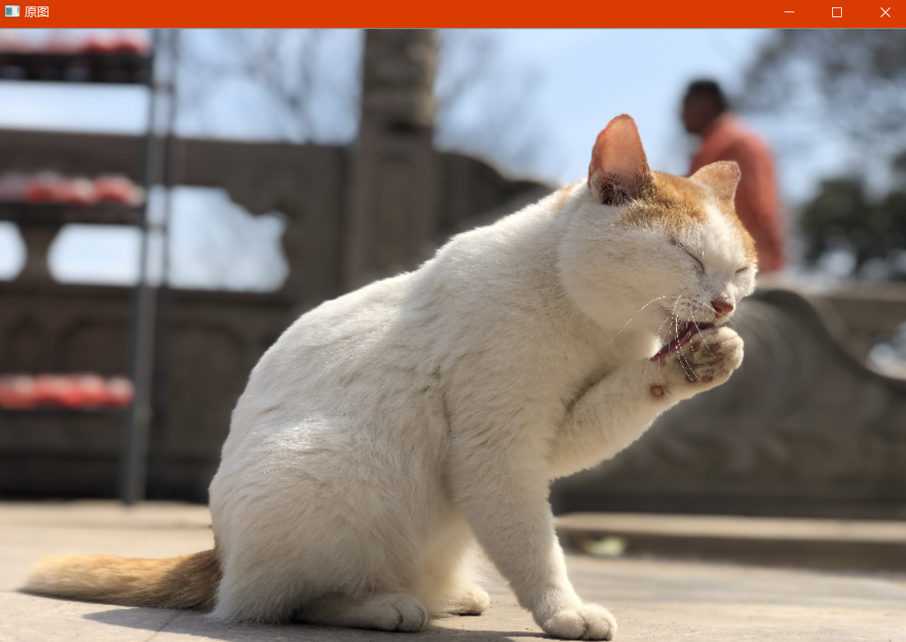
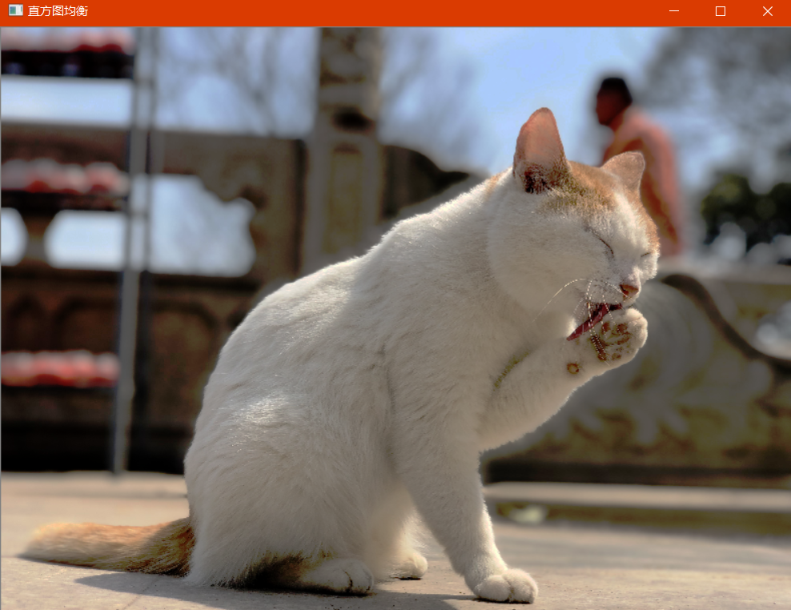

# OpenCV_Lab2_直方图

## 一、实验目的

掌握对图像直方图进行操作，实现图像的直方图均衡算法。  
1. 掌握求灰度图像归一化直方图方法
2. 掌握灰度图像的直方图均衡算法
3. 掌握对彩色图像进行直方图均衡的算法

## 二、实验内容
- 计算灰度图像的归一化直方图。
 具体内容：利用 OpenCV 对图像像素进行操作，计算归一化直方图.并在
窗口中以图形的方式显示出来
- 灰度图像直方图均衡处理
 具体内容：通过计算归一化直方图,设计算法实现直方图均衡化处理。
- 彩色图像直方图均衡处理
 具体内容： 在灰度图像直方图均衡处理的基础上实现彩色直方图均衡
处理。

## 三、实验原理
### 1，定义：
		直方图均衡化的英文名称是Histogram Equalization.图像对比度增强的方法可以分成两类:一类是直接对比度增强方法;另一类是间接对比度增强方法。直方图拉伸和直方图均衡化是两种最常见的间接对比度增强方法。直方图拉伸是通过对比度拉伸对直方图进行调整，从而“扩大”前景和背景灰度的差别，以达到增强对比度的目的，这种方法可以利用线性或非线性的方法来实现;直方图均衡化则通过使用累积函数对灰度值进行“调整”以实现对比度的增强。  
	　　直方图均衡化处理的“中心思想”是把原始图像的灰度直方图从比较集中的某个灰度区间变成在全部灰度范围内的均匀分布。直方图均衡化就是对图像进行非线性拉伸，重新分配图像像素值，使一定灰度范围内的像素数量大致相同。直方图均衡化就是把给定图像的直方图分布改变成“均匀”分布直方图分布。  
###　2，缺点：   
- 变换后图像的灰度级减少，某些细节消失； 
- 某些图像，如直方图有高峰，经处理后对比度不自然的过分增强。   

　　直方图均衡化是图像处理领域中利用图像直方图对对比度进行调整的方法。   

　　这种方法通常用来增加许多图像的局部对比度，尤其是当图像的有用数据的对比度相当接近的时候。通过这种方法，亮度可以更好地在直方图上分布。这样就可以用于增强局部的对比度而不影响整体的对比度，直方图均衡化通过有效地扩展常用的亮度来实现这种功能。  

　　这种方法对于背景和前景都太亮或者太暗的图像非常有用，这种方法尤其是可以带来X光图像中更好的骨骼结构显示以及曝光过度或者曝光不足照片中更好的细节。这种方法的一个主要优势是它是一个相当直观的技术并且是可逆操作，如果已知均衡化函数，那么就可以恢复原始的直方图，并且计算量也不大。这种方法的一个缺点是它对处理的数据不加选择，它可能会增加背景杂讯的对比度并且降低有用信号的对比度。  

　　直方图均衡化的基本思想是把原始图的直方图变换为均匀分布的形式，这样就增加了象素灰度值的动态范围从而可达到增强图像整体对比度的效果。设原始图像在(x，y)处的灰度为f，而改变后的图像为g，则对图像增强的方法可表述为将在(x，y)处的灰度f映射为g。在灰度直方图均衡化处理中对图像的映射函数可定义为:g = EQ (f)，这个映射函数EQ(f)必须满足两个条件(其中L为图像的灰度级数):  

　　(1)EQ(f)在0≤f≤L-1范围内是一个单值单增函数。这是为了保证增强处理没有打乱原始图像的灰度排列次序，原图各灰度级在变换后仍保持从黑到白(或从白到黑)的排列。  

　　(2)对于0≤f≤L-1有0≤g≤L-1，这个条件保证了变换前后灰度值动态范围的一致性。  

　　累积分布函数(cumulative distribution function，CDF)  
即可以满足上述两个条件，并且通过该函数可以完成将原图像f的分布转换成g的均匀分布。此时的直方图均衡化映射函数为:  
$$
　　gk = EQ(fk) = (ni/n) = pf(fi) , 　(k=0，1，2，……，L-1) 
$$
　　上述求和区间为0到k，根据该方程可以由源图像的各像素灰度值直接得到直方图均衡化后各像素的灰度值。在实际处理变换时，一般先对原始图像的灰度情况进行统计分析，并计算出原始直方图分布，然后根据计算出的累计直方图分布求出fk到gk的灰度映射关系。在重复上述步骤得到源图像所有灰度级到目标图像灰度级的映射关系后，按照这个映射关系对源图像各点像素进行灰度转换，即可完成对源图的直方图均衡化。

## 四、实验结果

