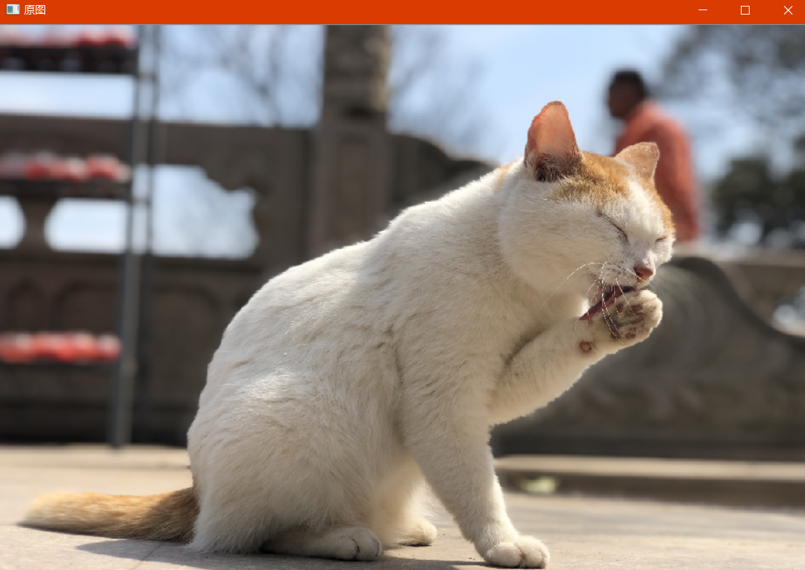
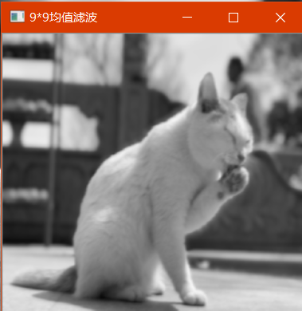
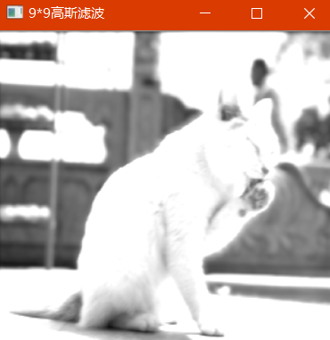
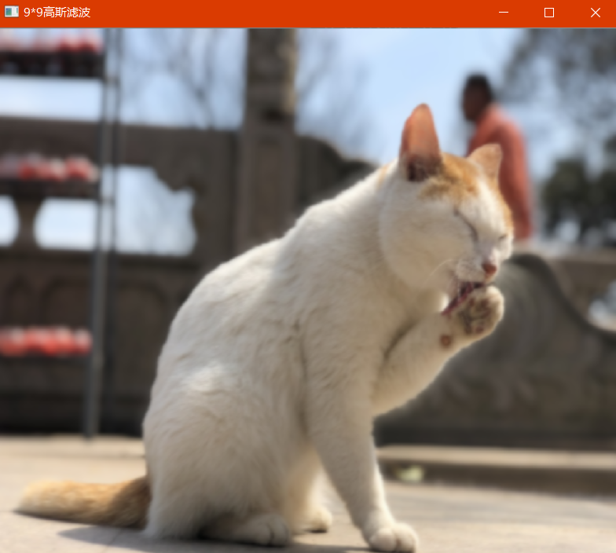

# OpenCV_Lab3_空域滤波

## 一、实验原理

### 1，空域滤波

> - 滤波是一种邻域处理方法，通过在图像空间对邻域内像素进行处理，达到平滑或者锐化图像的效果。
>
> - 空域滤波有线性滤波和非线性滤波：
> 	- 线性滤波：卷积
> 	- 非线性滤波 ：不是通过卷积运算，但是也是基于邻域的操作。比如：中值滤波，可以去除椒盐噪声
> 	
>

### 2，卷积过程
1. 将模板在图像中进行遍历，将模板中心和各个像素位置重合；
2. 将模板的各个系数与模板对应像素值进行相乘；
3. 将所有的乘积相加，并将求和结果赋值于模板中心对应的像素

$$
g(x, y) = \sum_{s=-a}^{a}\sum_{t=-b}^{b}w(s, t)f(x+s, y+t), a=\frac{m-1}{2}, b=\frac{n-1}{2}
$$

## 二、实验内容

使用空域滤波，对图像进行模糊和降噪，不过会导致图像的边缘和细节的锐度丢失。

### 1， 均值平滑模板

> 具体内容：利用 OpenCV 对图像像素进行操作，分别利用 3*3、5*5 和 9*9尺寸的均值模板平滑灰度图像

$$
\frac{1}{9}\begin{bmatrix}
1 & 1 & 1\\ 1
 & 1 & 1\\ 
1 &1  &1 
\end{bmatrix}
$$

不过均值平滑模板具有旁瓣泄漏效应，反应在图像中就是振铃效应，且模板尺寸越大，振铃效应也就越明显。

```c++
void MeanFilter(const Mat &src, Mat &dst, int ksize) {
	//generate mean mask
	double **templateMatrix = new double *[ksize];
	for (int i = 0; i < ksize; i++) {
		templateMatrix[i] = new double[ksize];
	}
	int tmp = ksize*ksize;
	int origin = ksize / 2;
	for (int i = 0; i < ksize; i++) {
		for (int j = 0; j < ksize; j++) {
			templateMatrix[i][j] = 1.0 / tmp;
		}
	}
}
```

均值滤波另外操作方法：

```c++
Mat blur3(Mat src) {
assert(src.depth() == CV_8U);
Mat dst;
dst.create(src.size(), src.type());
int num_channels = src.channels();
for (int r = 1; r < src.rows - 1; r++) {
const uchar* last_r = src.ptr<const uchar>(r - 1);
const uchar* curr_r = src.ptr<const uchar>(r);
const uchar* next_r = src.ptr<const uchar>(r + 1);
uchar* output = dst.ptr<uchar>(r);
for (int c = num_channels; c < (src.cols - 1)*num_channels; c++) {
*output++ = saturate_cast<uchar>((curr_r[c] + last_r[c] + next_r[c] +
curr_r[c - num_channels] + last_r[c - num_channels] + next_r[c - num_channels] +
curr_r[c + num_channels] + last_r[c + num_channels] + next_r[c + num_channels])/9);
}
}
//将边框的像素设置为0
dst.row(0).setTo(Scalar(0, 0, 0));
dst.row(dst.rows - 1).setTo(Scalar(0, 0, 0));
dst.col(0).setTo(Scalar(0, 0, 0));
dst.col(dst.cols - 1).setTo(Scalar(0, 0, 0));
return dst;
}
```

### 2，高斯模板

>  *具体内容：利用 OpenCV 对图像像素进行操作，分别利用 3***3、5***5 和 9\*9*
>
> 尺寸的高斯模板平滑灰度图像


标准差越小二维高斯图像越窄小，平滑效果不明显；标准差越大，滤波效果越好。随着sigma的增大，整个高斯函数的尖峰逐渐减小，整体也变的更加平缓，则对图像的平滑效果越来越明显。

```c++
void GaussianFilter(const Mat &src, Mat &dst, int ksize, double sigma)
{
	//generate gaussian mask
	const static double pi = 3.1415926;
	// 根据窗口大小和sigma生成高斯滤波器模板
	// 申请一个二维数组，存放生成的高斯模板矩阵
	double **templateMatrix = new double*[ksize];
	for (int i = 0; i < ksize; i++)
		templateMatrix[i] = new double[ksize];
	int origin = ksize / 2; // 以模板的中心为原点
	double x2, y2;
	double sum = 0;
	for (int i = 0; i < ksize; i++)
	{
		x2 = pow(i - origin, 2);
		for (int j = 0; j < ksize; j++)
		{
			y2 = pow(double(j - origin), 2);
			// 高斯函数前的常数可以不用计算，会在归一化的过程中给消去
			double g = exp(-(x2 + y2) / (2 * sigma * sigma));
			sum += g;
			templateMatrix[i][j] = g;
		}
	}

	double k = 1 / sum;
	for (int i = 0; i < ksize; i++) {
		for (int j = 0; j < ksize; j++) {
			templateMatrix[i][j] *= k;
		}
	}
}
```

### 3， Laplacian

> *具体内容：利用 OpenCV 对图像像素进行操作，分别利用 Laplacian、Robert、Sobel 模板锐化灰度图像。

- 拉普拉斯算子是最简单的各向同性微分算子，具有旋转不变性。如果在图像中一个较暗的区域中出现了一个亮点，那么用拉普拉斯运算就会使这个亮点变得更亮。因为图像中的边缘就是那些灰度发生跳变的区域，所以拉普拉斯锐化模板在边缘检测中很有用。一般增强技术对于陡峭的边缘和缓慢变化的边缘很难确定其边缘线的位置。但此算子却可用二次微分正峰和负峰之间的过零点来确定，对孤立点或端点更为敏感，因此特别适用于以突出图像中的孤立点、孤立线或线端点为目的的场合。同梯度算子一样，拉普拉斯算子也会增强图像中的噪声，有时用拉普拉斯算子进行边缘检测时，可将图像先进行平滑处理。

拉普拉斯算子差分形式：
$$
\triangledown ^{2}f(x, y) = f(x+1, y)+f(x, y+1) + f(x-1, y)+f(x, y-1)-4f(x, y)
$$
拉普拉斯模板：
$$
\begin{bmatrix}
0 &1  & 0\\ 
 1& -4 & 1\\ 
 0&1  &0 
\end{bmatrix}
$$

### 4,Robert模板

>  边缘定位准，但是对噪声敏感。适用于边缘明显且噪声较少的图像分割。Roberts边缘检测算子是一种利用局部差分算子寻找边缘的算子,Robert算子图像处理后结果边缘不是很平滑。经分析，由于Robert算子通常会在图像边缘附近的区域内产生较宽的响应，故采用上述算子检测的边缘图像常需做细化处理，边缘定位的精度不是很高。

$$
\begin{bmatrix}
0 &0  & 0\\ 
 0& -1 & 0\\ 
 0&0  &1 
\end{bmatrix}
\begin{bmatrix}
0 &0  & 0\\ 
 0& 0 & -1\\ 
 0&1 &0
\end{bmatrix}
$$

分别为x,y方向

### 5, Sobel模板

Sobel 算子是一个主要用作边缘检测的离散微分算子 (discrete differentiation operator)。 它结合了高斯平滑和微分求导，用来计算图像灰度函数的近似梯度。在图像的任何一点使用此算子，将会产生对应的梯度矢量或是其法矢量。Sobel算子认为，邻域的像素对当前像素产生的影响不是等价的，所以距离不同的像素具有不同的权值，对算子结果产生的影响也不同。一般来说，距离越远，产生的影响越小。
$$
\begin{bmatrix}
-1 &-2  & -1\\ 
 0& 0 & 0\\ 
 1&2 &1
\end{bmatrix}
\begin{bmatrix}
-1 &0  & 1\\ 
 -2& 0 & 2\\ 
 -1&0 &1
\end{bmatrix}
$$


### 6，高提升算法

> 高提升滤波算法增强灰度图像。 图像的锐化效果可以通过叠加图像的微分结果得到，也可以通过减除图像积分结果得到。
> 设原始图像为f(x,y),平滑后的图像为g(x,y)：
> 非锐化掩模：mask(x,y) = f(x,y) - g(x,y)
> 锐化图像：g(x,y) = k * mask(x,y) + f(x,y) |其中k为权重系数(k>=0)
> 当k=1时，为非锐化掩模；当k>=2时，为高提升滤波


## 三、实验完成情况

### 1，均值滤波

- [x] 利用均值模板平滑灰度图像。可以做到任意大小(奇数)的模板进行灰度图像的平滑，模板越大平滑效果越好。  
### 2, 高斯滤波
- [x] 利用高斯模板平滑灰度图像。可以做到任意大小(奇数)的模板进行灰度图像的平滑，高斯模糊实在均值平滑的基础上，把模板中的各个值加上一个系数，距离目标点越近的点和目标点的相关度越高，所以其系数也越高。

### 3,  对彩色图像处理
- [x] 根据输入图像的通道数进行判断输入图像是灰度图还是彩色图，如果是彩色图，那么分别对图像的每个通道进行处理。
## 四、实验遇到的问题

### 1，图片边缘问题

因为要对图片进行卷积处理，遇到边缘的时候，其外部没有数据，那么做卷积运算会出问题。所以需要先对图片进行扩充处理。

### 2，像素超范围问题

对图像进行锐化等操作后可能会使像素值超出0-255的范围，处理方法一种是对其进行整体缩放，另一种方法是对小于0的像素取0，大于255的像素取255。

## 五、实验结果


- [x] 原图



- [x] 均值滤波



- [x] 高斯滤波



- [x] 彩色图像处理



