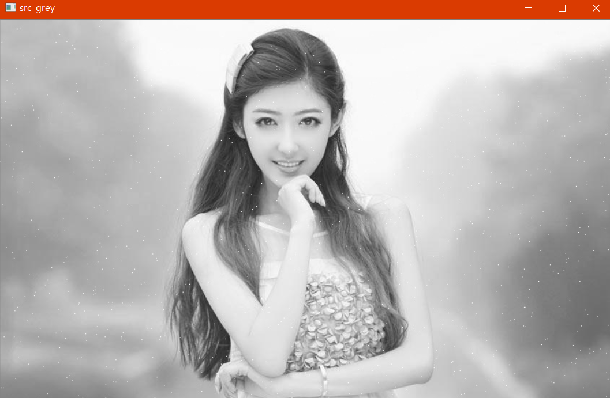
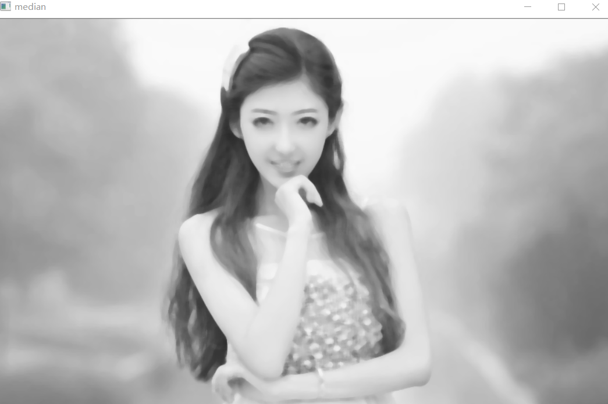
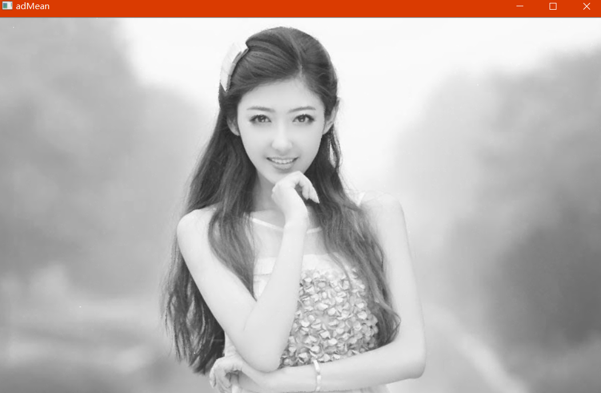

# OpenCV_Lab4_图像去噪

## 一、实验目的

1. 掌握算术均值滤波器、几何均值滤波器、谐波和逆谐波均值滤波器进行图像去噪的算法；
2. 掌握利用中值滤波器进行图像去噪的算法；
3. 掌握自适应中值滤波算法
4. 掌握自适应局部降低噪声滤波器去噪算法
5. 掌握彩色图像去噪步骤
## 二、实验内容

1. 均值滤波

```c++
利用OpenCV对图像像素进行操作，分别利用算术均值滤波器、几何均值滤波器、谐波和逆谐波滤波器进行图像去噪。模板大小为5*5.
```

2. 中值滤波

```c++
利用OpenCV对UI度图像像素进行操作。分别利用5*5和9*9尺寸的模板对图像进行中值滤波。
```

3. 自适应均值滤波


## 三、实验原理


### 1，图像预处理（加噪声）

- 高斯噪声

- 胡椒噪声

- 盐噪声

- 椒盐噪声

### 2，均值滤波

$$
g(x, y) = h(x,y)*f(x,y) + \eta(x,y)
$$

> h(x,y) 为退化函数，n(x,y) 加性噪声项

- 算术均值滤波
$$
f(x,y) = \frac{1}{mn}\sum_{(s,t)\epsilon S_{sy}}g(s,t)
$$

- 几何均值滤波

$$
f(x,y) = \begin{bmatrix}
\prod_{(s,t)\epsilon S_{xy})g(s,t)}
\end{bmatrix}^{\frac{1}{mn}}
$$

几何滤波器不可以去除胡椒噪声。

- 谐波均值滤波

$$
f(x,y) = \frac{mn}{\sum_{(s,t)\epsilon S_{xy}}\frac{1}{g(s,t)}}
$$

个滤波器不但不能去除椒盐噪声，对于灰度过黑的图像而言，效果也很差。这个滤波器的去噪效果还不如算术平均滤波器和几何平均滤波器

- 逆谐波均值滤波

$$
f(x,y) = \frac{\sum_{(s,t)\epsilon S_{xy} }g(s,t)^{Q+1}}{\sum_{(s,t)\epsilon S_{sy}}g(s,t)^Q}
$$

可以通过Q值的变化，来获得一定的效果。当Q为正，这个滤波器可以去除胡椒噪声，当Q为负，这个滤波器可以去除盐粒噪声

### 3，中值滤波

取像素点模板大小周围的中值当做该像素点的值。

### 4，自适应均值滤波

$$
w(n+1) = w(n) + \mu(n)e(n)
$$
权重更新收到输入信号的能量影响较大，输入信号能量越大，步长取值应该较小，保证不容易发散。步长太大，容易发散。步长太小，稳定，但是收敛速度慢，相互矛盾。

### 5，自适应中值滤波
常规的中值滤波器，在噪声的密度不是很大的情况下（根据经验，噪声的出现的概率小于0.2），效果不错。但是当概率出现的概率较高时，常规的中值滤波的效果就不是很好了。有一个选择就是增大滤波器的窗口大小，这虽然在一定程度上能解决上述的问题，但是会给图像造成较大的模糊。寻求一种改变，根据预先设定好的条件，在滤波的过程中，动态的改变滤波器的窗口尺寸大小，这就是自适应中值滤波器 Adaptive Median Filter。

## 四、实验结论
中值滤波器能够很好的滤除“椒盐”噪声。椒盐噪声是在图像上随机出现的孤立点，根据中值滤波器的原理，使用邻域像素的中值代替原像素，能够有效的消除这些孤立的噪声点。
和均值滤波器相比，中值滤波在消除噪声的同时，还能在很大程度保护图像的细节，不会造成很大的模糊。
和常规的中值滤波器相比，自适应中值滤波器能够更好的保护图像中的边缘细节部分。

- [x] 灰度图（高斯噪声）



- [x] 均值滤波


- [x] 谐波滤波


- [x] 中值滤波



- [x] 自适应均值滤波

