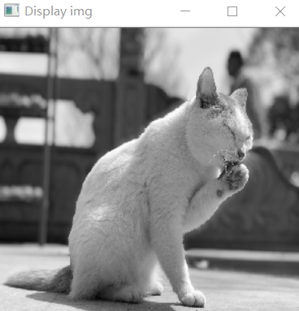
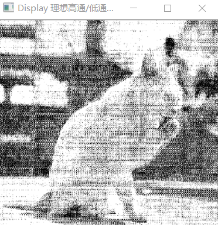
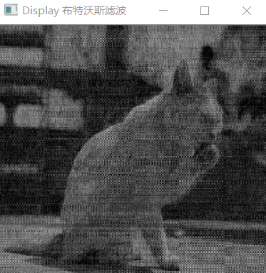
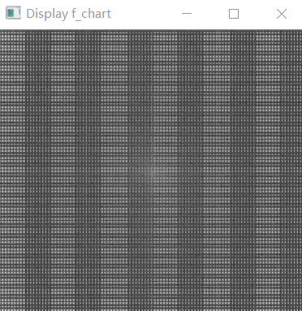

# OpenCV_Lab5_频域滤波

## 一、实验目的

1. 掌握图像进行频域滤波的方法和步骤
2. 掌握图像领域DFT变换和反变换的方法
3. 掌握图像频域滤波的步骤

## 二、实验内容

1. 灰度图像的DFT和IDFT

   利用 OpenCV 提供的 cvDFT 函数对图像进行 DFT 和 IDFT 变换

2. 利用理想高通和低通滤波器对灰度图像进行频域滤波

   利用 cvDFT 函数实现 DFT ，在频域上利用理想高通和低通滤波器进行滤波，并把滤波后的图像显示在屏幕上（观察振铃现象），要求截止频率可输入。

3. 利用布特沃斯高通和低通滤波器对灰度图像进行频域滤波

   利用 cvDFT 函数实现 DFT ，在频域上进行利用布特沃斯高通和低通滤波器进行滤波，并把滤波后的图像显示在屏幕上（观察振铃现象），要求截止频率和 n 可输入。

## 三、实验原理

### 1，灰度图像的DFT和IDFT

- DFT

DFT(DiscreteFourier Transform) 离散傅里叶变换的缩写。傅里叶变换可以将一幅图片分解为正弦和余弦两个分量，换而言之，他可以将一幅图像从其空域（spatial domain）转换为频域。

傅里叶转换的结果是复数，这也显示出了傅里叶变换是一副实数图像（real image）和虚数图像（complex image）叠加或者是幅度图像（magitude image）和相位图像（phase image）叠加的结果。

### 2，理想高通滤波和低通滤波对灰度图像进行频域滤波

公式：
$$
D(u,v) = [(y,P/2)^2 + (v,Q/2)^2]^{\frac{1}{2}}
$$

### 3，布特沃斯高/低通滤波器

公式：
$$
H(u,v) = \frac{1}{1+[D(u,v)/D_0]^{2n}}
$$

### 4，振铃现象

> 图像处理中，对一幅图像进行滤波处理，若选用的频域滤波器具有陡峭的变化，则会使滤波图像产生“振铃”，所谓“振铃”，就是指输出图像的灰度剧烈变化处产生的震荡，就好像钟被敲击后产生的空气震荡。

## 四、实验结果

- [x] 原图

- [x] 理想高通、低通滤波

- [x] 布特沃斯滤波

- [x] chart

