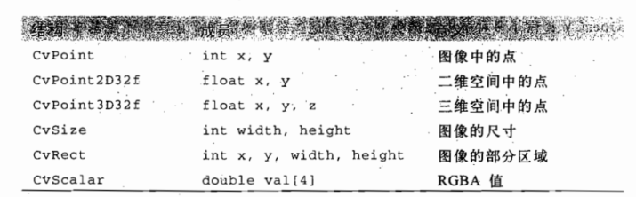
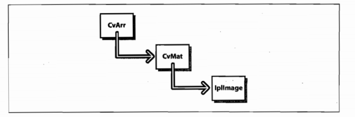
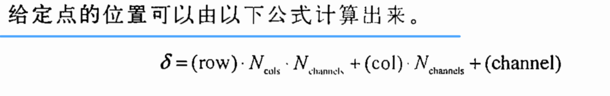
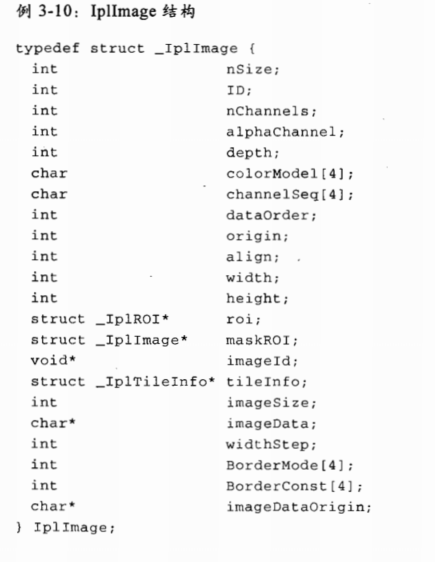
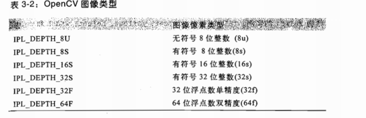

# Opencv学习

## 一、环境的配置

## 二、熟悉opencv常用操作

### 1， Mat对象

**imread：**
>  功能是加载图像文件成为一个**Mat**对象，其中第一个参数表示图像文件名称
第二个参数，表示加载的图像是什么类型，支持常见的三个参数值
MREAD_UNCHANGED (<0) 表示加载原图，不做任何改变
MREAD_GRAYSCALE ( 0)表示把原图作为灰度图像加载进来
MREAD_COLOR (>0) 表示把原图作为RGB图像加载进来

**显示图像**
cv::namedWindow  和  cv::imshow

> - namedWindow功能是创建一个OpenCV窗口，它是由OpenCV自动创建与释放，你无需取销毁它。
> - 常见用法namedWindow("Window Title", WINDOW_AUTOSIZE)
> - WINDOW_AUTOSIZE会自动根据图像大小，显示窗口大小，不能人为改变窗口大小
> - imshow根据窗口名称显示图像到指定的窗口上去，第一个参数是窗口名称，第二参数是Mat对象

**cv::imwrite**

```c++
Mat src, dst;
	//将图像以灰度图导入
	src = imread("D:/workspace/images/cat01.jpg", 1); 
	if (!src.data) {
		printf("could not load image...\n");
		return -1;
	}
	namedWindow("input window", 0);
	imshow("input window", src);
```

### 2，IplImage对象

IplImage是一种结构体：用来处理多通道，单通道，整型，浮点型的类型的图像文件。

cvLoadImage高层调用接口确定被加载文件的格式，自动分配图像数据结构的内存

代码演示：

```c++
# include "highgui.h"

int main(int argc, char** argv){
    IplImage* img = cvLoadImage(argv[1]);
    cvNamedWindow("Example), CV_WINDOW_AUTOSIZE);
    cvShowImage("Example", img);
    cvWaitKey(0);
    cvReleaseImage(&img);
    cvDestoryWindow("Example");
}
```

### 3, opencv 数据结构





cvMat的结构

```
typedef struct CvMat{
    int type;
    int step; // 行数据的长度
    int* refcount;
    union{
        uchar* ptr;
        short* s;
        int* i;
        float* fl;
        double* db;
        
    }data;
    union{
        int cols;
        int width;
    };
    union{
        int cols;
        int width;
    };
    
}CvMat;
矩阵的创建：
CvMat* cvCreatMat(int rows, int cols, int type);
```







### 4,Vec3b数据类型


## 三、图像二值化处理


## 四、图像通道解释


- 单通道
  也称灰度图，每个像素点只有一个值表示颜色。像素值在0-255之间（0：黑，255：白）。此外，也有三通道的灰度图，只是只有一个通道有值。

- 三通道

  每个像素点有三个值表示，例如RGB就是三通道图片。

- 四通道

  四个通道分别是：颜色分量（R、G 和 B）以及一个Alpha通道。Alpha通道用来衡量一个像素或者图像的透明度。当Alpha为0时，该像素为完全透明的。

> MAT存储三通道图像时，每一行的数据格式是 
>
> [Rdata，Gdata，Bdata, Rdata，Gdata，Bdata, Rdata，Gdata，Bdata, ...] 

演示代码：
```c++
#include<iostream>
#include<opencv2\core\core.hpp>
#include<opencv2\highgui\highgui.hpp>
#include<opencv2\imgproc\imgproc.hpp>
#include<opencv2\opencv.hpp>
 
using namespace std;
using namespace cv;
 
int main()
{
	//载入一张彩色图片并显示
	Mat srcImage=imread("G:\\Image\\lenaRGB.png",1);  
	namedWindow("Image",WINDOW_AUTOSIZE);
	imshow("Image",srcImage);
 
	int nHeight=srcImage.rows;
	int nWidth=srcImage.cols;
	
	//载入一张灰度图并显示，这里使用同一张图片 只是imread函数的最后一个参数不一样  效果是相同的
	Mat grayImage=imread("G:\\Image\\lenaRGB.png",0);
	namedWindow("grayImage",WINDOW_AUTOSIZE);
	imshow("grayImage",grayImage);
	
	//基本信息
	cout<<"图像的高度"<<nHeight<<endl;
	cout<<"图像的宽度"<<nWidth<<endl;
	cout<<"Image的通道数"<<srcImage.channels()<<endl;      //彩色图片的通道数
	cout<<"grayImage的通道数"<<grayImage.channels()<<endl; //灰度图片的通道数
 
	for(int i=0;i<nHeight;i++)
	{
		for(int j=0;j<nWidth;j++)
		{
			srcImage.at<uchar>(i,j)=0;
			grayImage.at<uchar>(i,j)=0;
		}
	}
	namedWindow("彩色图片处理后对应黑色图片",WINDOW_AUTOSIZE);
	imshow("彩色图片处理后对应黑色图片",srcImage);
 
	namedWindow("灰度图片处理后对应黑色图片",WINDOW_AUTOSIZE);
	imshow("灰度图片处理后对应黑色图片",grayImage);
 
	cvWaitKey(0);
	cvDestroyWindow("Image");
	cvDestroyWindow("grayImage");
	cvDestroyWindow("彩色图片处理后对应黑色图片");
	cvDestroyWindow("灰度图片处理后对应黑色图片");
 
	return 0;
 
}
from: https://blog.csdn.net/qq_32211827/article/details/56854985 

```

## 五、图像深度解释

### 1，解释

存储每个像素所用的位数，也用于度量图像的彩色分辨率。比如每个像素有8位，那么最大灰度数就是256。

opencv深度的显示范围：（当定义不同深度的时候，像素的灰度值要处于显示范围之中才能显示，否则要进行转换）。

> - unsigned char型：0--255之间                     IPL_DEPTH_8U
> - char型：-128--127之间                               IPL_DEPTH_8S 
> - unsigned short int型：0--65535之间           IPL_DEPTH_16U
> - short int型：-32768--32767之间                 IPL_DEPTH_16S
> - long型：0--65535之间                                IPL_DEPTH_32S
> - float型：0.0--1.0之间                                  IPL_DEPTH_32F
> - double型：0.0--1.0之间                              IPL_DEPTH_64F

### 2，图像深度的转换

```c++
IplImage* dst = cvCreateImage(cvGetSize(img),IPL_DEPTH_16U,img->nChannels);


//如果直接处理那么显示是有问题的
unsigned short* data = (unsigned short *)(pImg->imageData)
for ( i=0;i<HEIGH;i++)
for( j=0;j<WIDTH;j++)
{
data[j+i*(WIDTH)] = array[j+i*(WIDTH)];
}

//深度转换
// 找出dst中，所有数据的最大值和最小值
cvMinMaxLoc(dst , &m, &M, NULL, NULL, NULL); 
//把dst中的数据映射到0-65535的范围中
cvScale(dst , dst , 65535/(M-m), 65535*(-(m+1))/(M-m));
//完成了上述深度转换，接下来才能用cvshowImage来显示
cvShowImage( "source image", pImg );
```

### 3，图像的保存

对于深度位16的图片，用cvSaveImage是不能够保存的，因为cvSaveImage只能保存深度为8的图片。这里，用imwrite来保存，无压缩，png格式。

```c++
vector<int> compression_params;
compression_params.push_back(CV_IMWRITE_PNG_COMPRESSION);
compression_params.push_back(0); // 无压缩png.
sprintf(fileName, "Picture %d.png", ++countCamera); //生成文件名
cv::Mat pImgMat(pImg,0); //把IplImage转换为Mat
imwrite(fileName,pImgMat,compression_params); //保存图片
```

## 六、图像尺寸缩放

```c++
Mat srcImage=imread("1.jpg");
	Mat temImage,dstImage1,dstImage2;
	temImage=srcImage;
 
	//显示原图
	imshow("原图",srcImage);
 
	//尺寸调整
/*@param src input image.
	* @param dst output image;
	* @param dsize output image size;
	* @param fx scale factor along the horizontal axis;
	* @param fy scale factor along the vertical axis;
	* when it equals 0, it is computed as
	* \f[\texttt{(double)dsize.height/src.rows}\f]
	* @param interpolation interpolation method*/
resize(temImage,dstImage2,Size(temImage.cols*2,temImage.rows*2),0,0,INTER_LINEAR);
 
	imshow("缩小",dstImage1);
	imshow("放大",dstImage2);
 
	waitKey();
	return 0;
```

